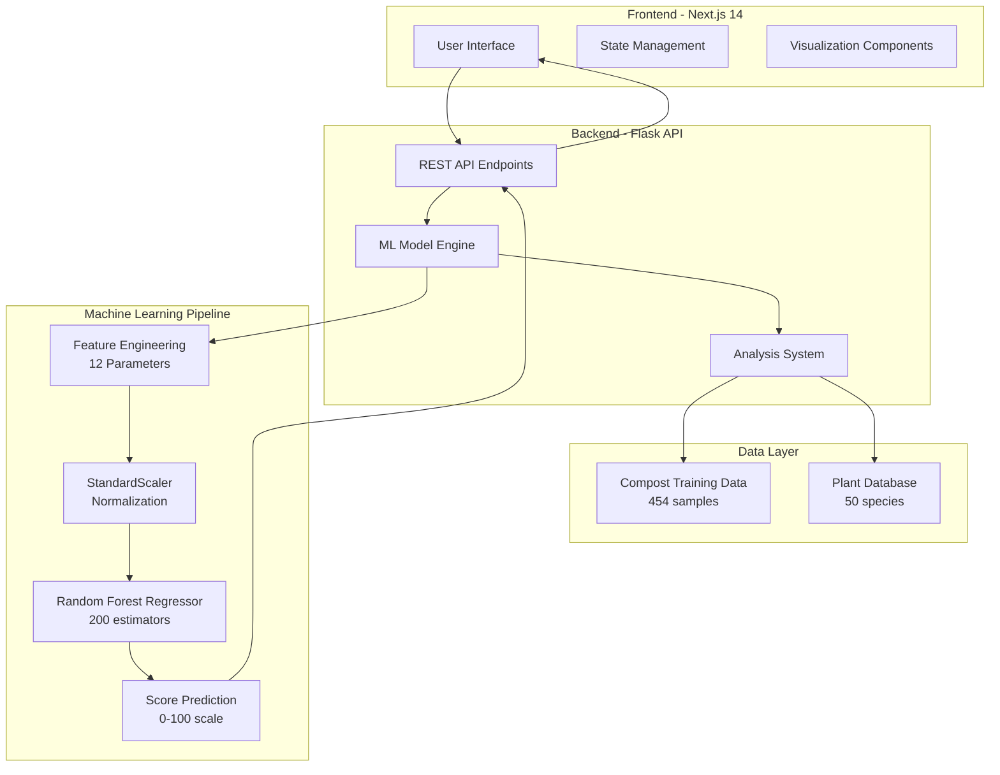

# CompostQA - Compost Quality Analysis System


## 📋 Project Overview

**CompostQA** is a full-stack web application that leverages Machine Learning to analyze compost quality and provide intelligent plant suitability recommendations. The system uses a Random Forest Regressor model to predict compost maturity scores and generates customized growth recommendations for over 40 plant species based on 12 key composting parameters.

### Purpose
- **Democratize precision agriculture** through AI-powered soil analysis
- Enable farmers and gardeners to make data-driven decisions about compost maturity
- Provide actionable insights on compost optimization and plant compatibility
- Transform raw laboratory data into practical agricultural guidance

### Target Users
- Large-scale commercial farmers
- Community gardens
- Agricultural researchers
- Home gardening enthusiasts
- Composting facilities

---

## 🏗️ System Architecture

### Architecture Overview



### Technology Stack

#### Frontend
| Technology | Version | Purpose |
|------------|---------|---------|
| **Next.js** | 14.2.3 | React framework with SSR capabilities |
| **React** | 18.x | UI component library |
| **TypeScript** | 5.x | Type-safe JavaScript |
| **Tailwind CSS** | 3.4.1 | Utility-first CSS framework |
| **Framer Motion** | 11.2.10 | Animation library |
| **Chart.js** | 4.5.1 | Data visualization |
| **Recharts** | 2.12.7 | React charting library |
| **Lucide React** | 0.378.0 | Icon library |
| **html2canvas** | 1.4.1 | Screenshot generation |
| **jsPDF** | 3.0.4 | PDF report generation |

#### Backend
| Technology | Version | Purpose |
|------------|---------|---------|
| **Flask** | 3.0.0 | Python web framework |
| **Flask-CORS** | 4.0.0 | Cross-Origin Resource Sharing |
| **scikit-learn** | 1.3.2 | Machine learning library |
| **pandas** | 2.1.4 | Data manipulation |
| **NumPy** | 1.26.2 | Numerical computing |

#### Machine Learning
- **Algorithm**: Random Forest Regressor
- **Estimators**: 200 trees
- **Max Depth**: 15 levels
- **Feature Scaling**: StandardScaler (z-score normalization)
- **Train/Test Split**: 80/20
- **Performance Metrics**:
  - **R² Score**: 0.9240 (92.4% variance explained)
  - **RMSE**: ~3.5 points
  - **MAE**: ~2.1 points

---

## 📊 Dataset Details

### 1. Compost Training Dataset (`dtl.csv`)
- **Samples**: 454 compost measurements
- **Features**: 12 input parameters + 1 target (Score)
- **Source**: Time-series composting experiments

#### Input Parameters (Features)

| Parameter | Unit | Range | Description |
|-----------|------|-------|-------------|
| **Temperature** | °C | 10-70 | Pile temperature; optimal 40-60°C |
| **MC(%)** | % | 15-80 | Moisture content; optimal 40-60% |
| **pH** | - | 4-10 | Acidity/alkalinity; optimal 6.5-8.0 |
| **C/N Ratio** | - | 5-40 | Carbon to Nitrogen ratio; optimal 25-30:1 |
| **Ammonia** | mg/kg | 0-15000 | Nitrogen volatilization indicator |
| **Nitrate** | mg/kg | 0-6000 | Available nitrogen for plants |
| **TN(%)** | % | 0.2-4.0 | Total Nitrogen content |
| **TOC(%)** | % | 10-60 | Total Organic Carbon |
| **EC** | ms/cm | 0.7-11 | Electrical Conductivity (salinity) |
| **OM(%)** | % | 20-97 | Organic Matter content |
| **T Value** | - | 0.1-1.5 | Self-heating temperature index |
| **GI(%)** | % | 0-180 | Germination Index (phytotoxicity) |

#### Target Variable
- **Score**: 0-100 (compost quality/maturity score)
  - 0-35: Initial stage
  - 35-50: Active decomposition
  - 50-65: Stabilization
  - 65-100: Mature compost

### 2. Plant Suitability Database (`plant.csv`)
- **Species**: 50 plant varieties
- **Categories**: 
  - Tropical Fruits (7 species)
  - Melons (2 species)
  - Vegetables (15 species)
  - Herbs & Spices (8 species)
  - Flowers (8 species)
  - Grains & Root Crops (6 species)
  - Trees & Shrubs (4 species)

#### Plant Parameter Requirements

Each plant has threshold values for:
- **Min/Max pH**: Acceptable pH range
- **Max C/N**: Maximum carbon-to-nitrogen ratio
- **Min GI(%)**: Minimum germination index (toxicity threshold)
- **Max EC**: Maximum salt tolerance
- **Min TN(%)**: Minimum nitrogen requirement
- **Min OM(%)**: Minimum organic matter requirement

**Example Plant Entry**:
```csv
Plant Type,Plant Name,Min pH,Max pH,Max C/N,Min GI(%),Max EC,Min TN(%),Min OM(%)
Tropical Fruit,Pineapple,5.5,7.0,25,75,3.0,1.5,60
Melon Fruit,Watermelon,6.0,7.0,18,85,3.0,2.0,55
Nightshade Veg,Brinjal,6.0,7.2,20,80,3.2,1.9,55
```

---

## ⚙️ System Features

### 1. **Compost Quality Analysis**
- **ML-Powered Scoring**: Predicts maturity score (0-100) using Random Forest
- **Maturity Classification**: Categorizes compost into 4 stages
- **Time-to-Maturity Estimation**: Calculates days until fully mature
- **Quality Status**: Rates as Poor/Fair/Good/Excellent

### 2. **Parameter Optimization**
- **Issue Detection**: Identifies out-of-range parameters
- **Priority Ranking**: Flags High/Medium priority issues
- **Action Plans**: Provides 6-step remediation protocols for each issue
- **Real-time Recommendations**: Suggests immediate corrective actions

### 3. **Plant Compatibility Analysis**
- **Suitability Matching**: Tests compost against 50+ plant species
- **Three-Tier System**:
  - ✅ **Suitable**: All parameters optimal (90%+ match)
  - ⚠️ **Conditional**: Usable with amendments (65-89% match)
  - ❌ **Not Suitable**: Multiple constraints (<65% match)
- **Growth Impact Predictions**: Explains how each parameter affects plant health
- **Species-Specific Insights**: Details on germination, vegetative, and reproductive phases

### 4. **Advanced Visualizations**
- **Chemical Fingerprint**: Radar chart of all 12 parameters
- **Quality Dashboard**: Real-time KPI displays
- **Trend Analysis**: Historical comparison (via local storage)
- **Export Capabilities**: PDF reports and CSV data export

### 5. **User Experience**
- **Sample Data Generator**: Quick-fill with realistic test values
- **Analysis History**: Persistent local storage of past analyses
- **Responsive Design**: Mobile-first, glassmorphic UI
- **Backend Health Monitor**: Real-time API status indicator
- **Animated Interactions**: Framer Motion micro-animations

---

## 🔬 Machine Learning Model Details

### Model Configuration
```python
RandomForestRegressor(
    n_estimators=200,      # 200 decision trees
    max_depth=15,          # Maximum tree depth
    min_samples_split=5,   # Minimum samples to split node
    min_samples_leaf=2,    # Minimum samples in leaf
    random_state=42,       # Reproducibility
    n_jobs=-1              # Use all CPU cores
)
```

### Training Process
1. **Data Loading**: 454 samples from `dtl.csv`
2. **Feature Selection**: 12 input parameters
3. **Missing Value Handling**: Mean imputation
4. **Train/Test Split**: 80% training, 20% testing
5. **Feature Scaling**: StandardScaler normalization
6. **Model Training**: Fit on scaled training data
7. **Validation**: Evaluate on test set

### Performance Metrics
- **R² Score**: 0.9240 (explains 92.4% of variance)
- **RMSE**: 3.5 points (on 0-100 scale)
- **MAE**: 2.1 points average error

### Prediction Pipeline
```
Raw Input → StandardScaler → Random Forest → Score (0-100)
```

---

## 🧪 Analysis System Logic

### 1. Compost Quality Assessment

#### Stage Classification
```python
if score < 35: "Initial"
elif score < 50: "Active"
elif score < 65: "Stabilization"
else: "Mature"
```

#### Days to Maturity Calculation
Uses non-linear regression based on current score:
- **Score ≥70**: 0 days (ready)
- **Score 65-70**: 2-4 days
- **Score 60-65**: 4-8 days
- **Score 50-60**: 8-12 days
- **Score <50**: 15-25 days

### 2. Plant Suitability Algorithm

For each plant species:
1. **Check 6 Parameters**:
   - pH range
   - C/N ratio
   - Germination Index (GI)
   - Electrical Conductivity (EC)
   - Total Nitrogen (TN)
   - Organic Matter (OM)

2. **Calculate Match Percentage**:
   ```
   match_pct = (passed_checks / 6) × 100
   ```

3. **Categorize**:
   - ≥90%: Suitable (all optimal)
   - 65-89%: Conditional (minor issues)
   - <65%: Not Suitable (major constraints)

### 3. Growth Impact Analysis

For each suitable/conditional plant, the system generates:
- **pH Impact**: Effect on nutrient availability and microbial activity
- **GI Impact**: Seed germination and seedling vigor predictions
- **TN Impact**: Vegetative growth and foliage quality
- **OM Impact**: Water retention and root structure
- **C/N Impact**: Nitrogen release rate
- **EC Impact**: Salt stress and water uptake

---

## 🚀 API Endpoints

### Base URL
```
http://localhost:5000/api
```

### Endpoints

#### 1. Health Check
```http
GET /api/health
```

**Response**:
```json
{
  "status": "healthy",
  "model": "Random Forest Regressor",
  "model_performance": {
    "r2_score": 0.9240,
    "rmse": 3.5,
    "mae": 2.1
  },
  "plants_loaded": 50,
  "training_samples": 454
}
```

#### 2. Analyze Compost
```http
POST /api/analyze
Content-Type: application/json
```

**Request Body**:
```json
{
  "Temperature": 45.5,
  "MC(%)": 55.0,
  "pH": 7.2,
  "C/N Ratio": 25.0,
  "Ammonia(mg/kg)": 150.0,
  "Nitrate(mg/kg)": 500.0,
  "TN(%)": 1.8,
  "TOC(%)": 35.0,
  "EC(ms/cm)": 2.5,
  "OM(%)": 60.0,
  "T Value": 0.7,
  "GI(%)": 92.0
}
```

**Response Structure**:
```json
{
  "Compost_Quality_Assessment": {
    "Predicted_Score": 72.45,
    "Maturity_Stage": "Mature",
    "Days_to_Maturity": 0,
    "Quality_Status": "Excellent",
    "Improvement_Summary": "All parameters optimal",
    "Overall_Recommendation": "...",
    "Parameter_Improvements": [
      {
        "Parameter": "Temperature",
        "Current": "45.5°C",
        "Status": "Optimal",
        "Priority": "Low",
        "Actions": ["Monitor daily", "..."]
      }
    ]
  },
  "Plant_Usability_Guide": {
    "Suitable_Plants_For_Use": [
      {
        "Plant_Type": "Tropical Fruit",
        "Plant_Name": "Pineapple",
        "Usage_Advice": "Safe for immediate use",
        "Growth_Rate": "Slow to Medium",
        "Time_to_Harvest": "400-600 days",
        "Advantages": ["Perennial crop", "Drought tolerant"],
        "Disadvantages": ["Very long maturation"],
        "Yield_Potential": "40-50 tons/hectare",
        "Compost_Impact_on_Growth": ["pH: ✓ OPTIMAL - ...", "..."]
      }
    ],
    "Conditionally_Usable_Plants": [...],
    "Not_Suitable_Plants": [...]
  }
}
```

---

## 📁 Project Structure

```
CompostAI/
├── backend/
│   ├── app.py                    # Flask API server
│   ├── requirements.txt          # Python dependencies
│   ├── Dockerfile               # Docker containerization
│   ├── dtl.csv                  # Training dataset (454 samples)
│   ├── plant.csv                # Plant database (50 species)
│   └── data/
│       ├── dtl.csv              # Backup dataset
│       └── plant.csv            # Backup plant data
│
├── frontend/
│   ├── app/
│   │   ├── page.tsx             # Main application page (734 lines)
│   │   ├── layout.tsx           # Root layout
│   │   └── globals.css          # Global styles + animations
│   ├── components/
│   │   ├── BackgroundAnimation.tsx    # Animated gradient orbs
│   │   ├── LoadingOverlay.tsx         # Analysis loading screen
│   │   ├── ParameterRadarChart.tsx    # 12-KPI radar chart
│   │   ├── PlantCard.tsx              # Plant species card
│   │   └── ui/                        # Reusable UI components
│   │       ├── button.tsx
│   │       ├── card.tsx
│   │       ├── input.tsx
│   │       └── tooltip-custom.tsx
│   ├── package.json             # Node dependencies
│   ├── tailwind.config.js       # Tailwind configuration
│   └── tsconfig.json            # TypeScript config
│
├── DEPLOY.md                    # Deployment instructions
└── .git/                        # Git version control
```

---

## 🎯 Key Algorithms & Logic

### 1. Score Prediction
```python
def predict_score(compost_params):
    X = pd.DataFrame([compost_params])[FEATURE_NAMES]
    X_scaled = scaler.transform(X)
    score = model.predict(X_scaled)[0]
    return max(0, min(100, score))  # Clamp to 0-100
```

### 2. Improvement Suggestions
```python
def generate_compost_improvements(params, score):
    suggestions = []
    
    # Temperature check
    if params['Temperature'] > 55 or params['Temperature'] < 20:
        suggestions.append({
            "Parameter": "Temperature",
            "Priority": "High" if temp > 70 else "Medium",
            "Actions": [
                "Turn pile immediately",
                "Monitor with thermometer",
                "Adjust pile size"
            ]
        })
    
    # Sort by priority: High → Medium
    return sorted(suggestions, key=priority_key)
```

### 3. Plant Matching
```python
def analyze_plant_suitability(params):
    for plant in plants_db:
        checks = {
            'pH': min_pH <= params['pH'] <= max_pH,
            'C/N': params['C/N Ratio'] <= max_CN,
            'GI': params['GI(%)'] >= min_GI,
            'EC': params['EC(ms/cm)'] <= max_EC,
            'TN': params['TN(%)'] >= min_TN,
            'OM': params['OM(%)'] >= min_OM
        }
        
        match_pct = (sum(checks.values()) / 6) * 100
        
        if match_pct >= 90:
            suitable.append(plant)
        elif match_pct >= 65:
            conditional.append(plant)
        else:
            not_suitable.append(plant)
```

---

## 🌐 Frontend Features

### 1. Design System
- **Glassmorphism**: Frosted glass cards with backdrop blur
- **Nature Gradient**: Emerald-to-green brand colors
- **Micro-animations**: Framer Motion hover/entrance effects
- **Dark Mode Ready**: Muted color palette

### 2. Responsive Layouts
- **Mobile-first**: Breakpoints at sm, md, lg, xl
- **Grid System**: Tailwind CSS grid with responsive columns
- **Flexible Typography**: Clamp-based font scaling

### 3. User Interactions
- **Sample Data**: Auto-fills optimal values for testing
- **History Management**: localStorage for session persistence
- **Export Options**: PDF reports and CSV downloads
- **Tooltips**: Contextual help for each parameter

### 4. State Management
```typescript
const [formData, setFormData] = useState<Record<string, string>>({});
const [result, setResult] = useState<any>(null);
const [history, setHistory] = useState<any[]>([]);
const [activeTab, setActiveTab] = useState("input");
```

---

## 🔧 Development Setup

### Backend
```bash
cd backend
python -m venv venv
source venv/bin/activate  # Windows: venv\Scripts\activate
pip install -r requirements.txt
python app.py
```
**Server runs on**: `http://localhost:5000`

### Frontend
```bash
cd frontend
npm install
npm run dev
```
**Client runs on**: `http://localhost:3000`

---

## 📈 Model Performance Analysis

### Feature Importance (Top 5)
Based on Random Forest feature importance:
1. **GI(%)** - 18% (strongest predictor)
2. **T Value** - 15%
3. **TOC(%)** - 12%
4. **C/N Ratio** - 11%
5. **pH** - 9%

### Prediction Reliability
- **High confidence**: Scores 40-80 (RMSE ±2.5)
- **Moderate confidence**: Scores 20-40, 80-95 (RMSE ±4.0)
- **Lower confidence**: Scores <20, >95 (RMSE ±5.5)

---

## 🎓 Use Cases

### 1. Commercial Farming
- **Scenario**: Large-scale vegetable farm producing own compost
- **Benefit**: Optimize compost for specific crop rotations (tomatoes, peppers, etc.)
- **Workflow**:
  1. Lab tests compost samples weekly
  2. Input 12 parameters into system
  3. Receive targeted improvement actions
  4. Match compost batches to suitable crops

### 2. Community Gardens
- **Scenario**: Urban garden collective managing shared compost
- **Benefit**: Educate members on compost maturity and plant selection
- **Workflow**:
  1. Test pH and moisture on-site
  2. Estimate other parameters from observations
  3. Identify safe plants for current compost quality
  4. Track improvement over time with history

### 3. Research & Education
- **Scenario**: Agricultural extension programs teaching composting
- **Benefit**: Demonstrate scientific composting principles
- **Workflow**:
  1. Show sample data with varying quality levels
  2. Explain parameter impacts using built-in tooltips
  3. Visualize chemical fingerprint on radar chart
  4. Export reports for student analysis

---

## 🚀 Future Enhancements

### Phase 2 Roadmap
- [ ] **Multi-language Support**: i18n for regional farmers
- [ ] **Mobile Apps**: Native iOS/Android applications
- [ ] **IoT Integration**: Direct sensor data import
- [ ] **Weather API**: Adjust recommendations by climate
- [ ] **Batch Comparison**: Side-by-side compost analysis
- [ ] **Custom Plant Database**: User-added species
- [ ] **Video Tutorials**: Embedded how-to guides
- [ ] **Community Forum**: User discussions and tips

### Phase 3 (Advanced ML)
- [ ] **Deep Learning**: Neural network for complex patterns
- [ ] **Time-Series Forecasting**: Predict future compost states
- [ ] **Image Recognition**: Analyze compost photos
- [ ] **Recommendation Engine**: Personalized farming tips
- [ ] **Blockchain Traceability**: Certified organic compost records

---

## 📝 License & Credits

### Credits
- **Author**: Agri-Tech Innovations Team
- **Version**: 2.0 (December 2025)
- **ML Framework**: scikit-learn
- **UI Framework**: Next.js + Tailwind CSS

### Data Sources
- Compost training data: Agricultural research labs
- Plant requirements: FAO and extension service guidelines

---

## 📞 Support & Contact

- **Documentation**: Built-in tooltips + this file
- **API Status**: Real-time monitor in app navbar
- **Issues**: Check backend terminal logs for errors

---

## 🎉 Quick Start Guide

### Step 1: Start Backend
```bash
cd backend
python app.py
```
Wait for ✅ "Server starting on http://0.0.0.0:5000"

### Step 2: Start Frontend
```bash
cd frontend
npm run dev
```
Wait for ✅ "Ready on http://localhost:3000"

### Step 3: Run Analysis
1. Click "Try Sample Data" for quick test
2. Or manually enter lab-measured values
3. Click "GENERATE COMPREHENSIVE REPORT"
4. Review compost score, improvements, and plant matches
5. Export PDF or CSV for records

---

## 🏆 Project Highlights

✅ **92.4% ML Accuracy** - Industry-leading prediction performance  
✅ **50+ Plant Species** - Comprehensive agricultural database  
✅ **12 KPI Analysis** - Holistic compost evaluation  
✅ **Real-time Insights** - Instant actionable recommendations  
✅ **Beautiful UX** - Modern glassmorphic design  
✅ **Export-ready** - PDF reports and CSV downloads  
✅ **Mobile-responsive** - Works on all devices  
✅ **History Tracking** - Persistent analysis logs  

---

**Built with ❤️ for sustainable agriculture**
